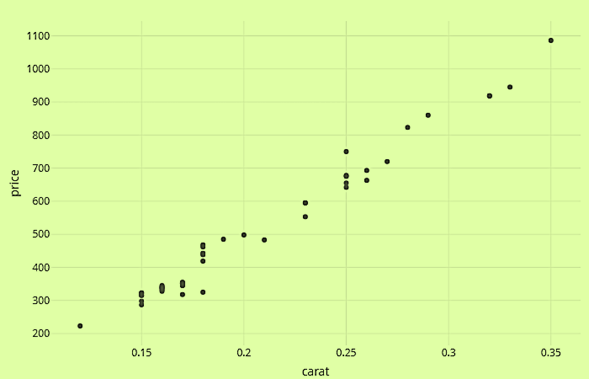

```{r setup, include=FALSE}
knitr::opts_chunk$set(echo = FALSE)
```

## Shiny Application and Reproducible Pitch

About the Course Project Instructions:

1. Write a shiny application with associated supporting documentation. The documentation should be thought of      as whatever a user will need to get started using your application.
2. Deploy the application on Rstudio’s shiny server.
3. Share the application link by pasting it into the provided text box.
4. Share your server.R and ui.R code on github. 

## How to use the application

Using the data provided by Galton Families dataset, we fit a linear model to predict a child’s height based on the gender and parent’s average height.

ui.R, and Server.R Code in my github repository 
(https://github.com/xssokolova/Course-Project-Shiny-Application-and-Reproducible-Pitch)

## Diamond dataset

The diamonds dataset we used in this application exercise consists of prices (SIN $) and carat mass.

    'data.frame':    48 obs. of  2 variables:
    $ carat: num  0.17 0.16 0.17 0.18 0.25 0.16 0.15 0.19 0.21 0.15 ...
    $ price: int  355 328 350 325 642 342 322 485 483 323 ...


## Interactive Plot
 



